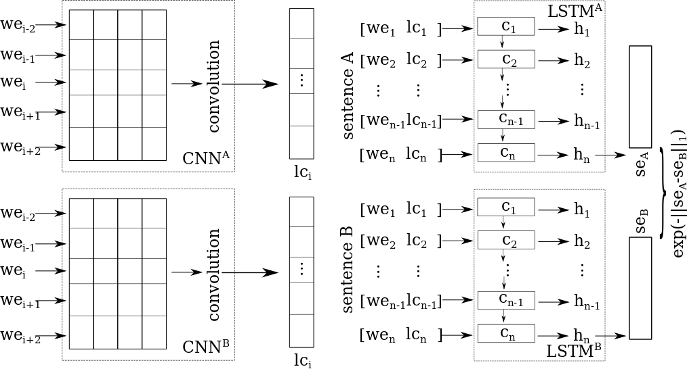

# Siamese CNN+LSTM to calculate the semantic similarity of a pair of sentences

Semantic Text Similarity (STS) is an important task in Natural Language Processing (NLP) applications such as information retrieval,  classification, extraction, question answering, and plagiarism detection. The STS task measures the degree of similarity between two texts and can be expressed as follows: given two sentences, a system returns a continuous score on a scale from 1 to 5, with 1 indicating that the semantics of the sentences are completely independent and 5 meaning that there is a semantic equivalence.

**This project corresponds to the system of the article "Predicting the Semantic Textual Similarity with Siamese CNN and LSTM." presented at the 25e Conférence sur le Traitement Automatique des Langues Naturelles (TALN) 2018.**

## Siamese LSTM+CNN
------------------------
We analyze the words in two perspectives: general and local contexts. Words are considered through time from the general information of a word (word embedding) and its specific semantic and syntactic features (local context) based on its previous and its following words. We apply a CNN to investigate the local context for each word in a sentence. The CNN analyzes together all the words of the local context and generates their representation as a unique structure. Then, we utilize an LSTM to examine the words of the sentence one by one (Figure 1).  Our NN has a Siamese structure, i.e. our CNN^A and our LSTM^A are equal to our CNN^B and our LSTM^B, respectively. The following subsection describes our CNN, our LSTM, and our similarity metrics to predict the sentence similarity.



## Data:
------------------------
Download the pre-trained word and phrase vectors model "GoogleNews-vectors-negative300.bin.gz" from https://code.google.com/archive/p/word2vec/ and put this file in the folder "data".

We reused the approach of Mueller and Thyagarajan to expand the SICK dataset. https://github.com/aditya1503/Siamese-LSTM

## How to run

```
$ virtualenv -p python3 virtualenv
$ source virtualenv/bin/activate
$ pip install -r requirements.txt 
$ python modules/main.py [options/defaults]

options:
  --bool_load_model 
            Bool to load a pretrained model (type : bool)
            default : False
  --bool_pretrain
            Bool to pretrain the system (type : bool)
            default : True
  --bool_train
            Bool to train the system (type : bool)
            default : True
  --bool_test
            Bool to test the system (type : bool)
            default : True
  --batch_size
            Batch size (type : int)
            default : 32
  --nb_epochs_pretrain
            Number of epochs of pretrain (type : int)
            default : 66
  --nb_epochs
            Number of epochs (type : int)
            default : 301
  --max_length
            Max sentence length (type : int), 
            default : 50
  --hidden_size
            Hidden layer size (type : int)
            default : 50
  --forget_bias
            Forget bias (type : float)
            default : 2.5
  --learning_rate
            Learning rate (type : float)
            default : 0.1
  --number_layers
            Number of layers (type : int)
            default : 1
  --dropout
            Dropout value (type : float)
            default : 0.5
  --word_emb_size
            Word embedding size (type : int)
            default : 300
  --local_context_size
            Local context size (type : int)
            default : 5
```

## Learn more
------------------------
We published a paper about this system at TALN 2018 - please reference it if you use or want to refer to our system in one of your publications.

Linhares Pontes, Elvys; Huet, Stéphane; Linhares, Andréa Carneiro; Torres-Moreno, Juan-Manuel. Predicting the Semantic Textual Similarity with Siamese CNN and LSTM. 25e Conférence sur le Traitement Automatique des Langues Naturelles (TALN) 2018.

    Link: https://hal.archives-ouvertes.fr/hal-01779457/


